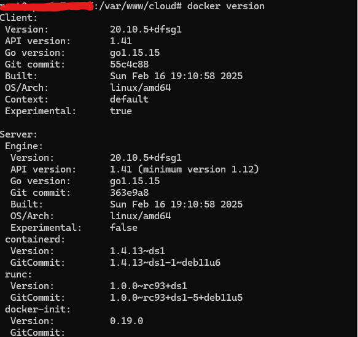

Claro 😄 vamos deixar esse projeto **com cara profissional**.

Posso escrever o **README.md completo** pra você, mas preciso alinhar **o conteúdo certo**.
Enquanto isso, já te deixo **um modelo pronto (MVC / PHP / Apache)** que você pode usar agora mesmo 👇

---

## 📄 Modelo de `README.md` (copiar e colar)

````md
# GrilloCloud

Plataforma web desenvolvida em PHP seguindo arquitetura MVC, com foco em organização, segurança e fácil manutenção.

## 🚀 Tecnologias utilizadas

- PHP 8+
- Apache 2.4
- MySQL / MariaDB
- HTML5 / CSS3 / JavaScript
- Git & GitHub
- Debian Linux

## 📁 Estrutura do projeto

```text
cloud/
├── index.php          # Front Controller
├── control/           # Controllers
├── model/             # Models
├── public/            # Assets públicos (css, js, img)
├── views/             # Views
└── README.md
````

## 🧠 Arquitetura

O projeto utiliza o padrão **MVC (Model-View-Controller)**:

* **Model**: regras de negócio e acesso a dados
* **Controller**: lógica da aplicação
* **View**: renderização da interface
* **index.php**: ponto único de entrada (Front Controller)

## 🔐 Segurança

* Acesso direto às pastas `model` e `control` bloqueado via Apache
* Listagem de diretórios desativada
* Versão do Apache e sistema ocultadas
* Apenas o `index.php` é acessível publicamente

## ⚙️ Requisitos

* PHP 8 ou superior
* Apache com `mod_rewrite` habilitado
* MySQL ou MariaDB
* Git

## 🛠️ Instalação

```bash
git clone git@github.com:grilloforemancloud/grillocloud.git
cd grillocloud
```

Configure o VirtualHost do Apache apontando para o diretório do projeto:

```apache
DocumentRoot /var/www/cloud
```

Reinicie o Apache:

```bash
sudo systemctl restart apache2
```
## Configuracoes extras 1.0

É necessário configurar o docker para responder por API eu vou passar um link que ensina fazer essa parte.

[link](https://prt.console-linux.com/?p=3437)
##Configurações extras 1.1
Nos arquivos php alguns são necessários passar a versão da api docker que o seu sistema usa,
no caso desse projeto 1.41 é necessário alterar para fazer funcionar de acordo com o seu sistema.


## ▶️ Executando o projeto

Acesse no navegador:

```
acesse no navegador de acordo com que definiu de url, no apache ServerName url, caso seja local tem que modificar hosts.conf e colocar url estabelecida
```

## 📌 Status do projeto

🚧 Em desenvolvimento

## 👤 Autor

**Grillo Foreman**
GitHub: [https://github.com/grilloforemancloud](https://github.com/grilloforemancloud)


